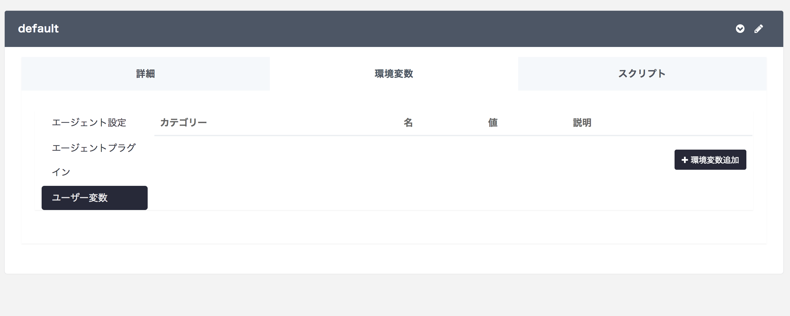
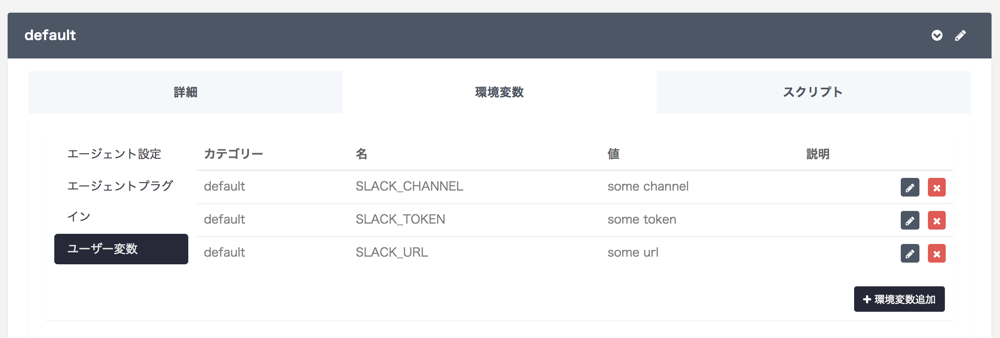

# study-picamera-slack

Isaaxを使って、Picameraで認識した人の画像をSlackにアップロードするデモアプリケーションです。

**_ OpenCV3のコンパイルはとても時間がかかります。Isaax勉強会ではあらかじめインストールしたものを使うため、再インストールが必要な場合はスタッフに相談してください。 _**

## Table of contents

- [Installation](#installation)
  - [Enable camera interface](#enable-camera-interface)
  - [Expand file system](#expand-file-system)
  - [Install OpenCV3](#install-opencv3)
- [Set up Isaax](#set-up-isaax)

## Installation

このインストールガイドは、下記の環境で実行しています。

- Raspberry Pi 3
- SDカード 16GB以上
- Raspbian Stretch lite (2017-11-29リリース)

また、ディスプレイ接続やSSHなどでRaspberry Piのターミナルにログインした上でおこなってください。

### Enable camera interface

カメラモジュールにアクセスできるように下記のコマンドを実行します。設定を有効にするために再起動が必要ですが、次の節で再起動するためここでは行いません。

```
sudo raspi-config nonint do_camera 0
```

### Expand Filesystem

最初にRaspbianを起動した時点ではSDカードの一部の領域しか使えません。そのため、ファイルシステムを拡張してより多くの領域をストレージとして扱えるようにします。

```
$ sudo raspi-config
```

「7 Advanced Options」から「A1 Expand Filesystem」を選択します。再起動するかどうか聞かれるので、「Yes」を選択して再起動します。

### Install OpenCV3

OpenCV3はソースコードからビルドします。必要となる依存パッケージをはじめにインストールします。このインストールガイドは、[こちらの記事](https://www.pyimagesearch.com/2017/09/04/raspbian-stretch-install-opencv-3-python-on-your-raspberry-pi/)を参考にしています。

```
$ sudo apt update && sudo apt upgrade
$ sudo apt install build-essential cmake pkg-config
$ sudo apt install libjpeg-dev libtiff5-dev libjasper-dev libpng12-dev
$ sudo apt install libavcodec-dev libavformat-dev libswscale-dev libv4l-dev
$ sudo apt install libxvidcore-dev libx264-dev　libgtk2.0-dev　libgtk-3-dev
$ sudo apt install libatlas-base-dev gfortran
$ sudo apt install python3-dev python3-pip
$ sudo pip install numpy
```

ここではPythonの`cv2`モジュールをグローバル環境にインストールすることを想定しています。必要に応じて`virtualenv`や`venv`を使って切り分けた環境で`numpy`をインストールして進めてください。次に、OpenCV3のビルドに必要なソースコードをダウンロードします。

```
$ wget -O opencv.zip https://github.com/Itseez/opencv/archive/3.3.1.zip
$ wget -O opencv_contrib.zip https://github.com/Itseez/opencv_contrib/archive/3.3.1.zip
$ unzip opencv\*.zip
```

`opencv-3.3.1/`に移動し、`build`ディレクトリで`cmake`を実行します。

```
$ cd ~/opencv-3.3.1/
$ mkdir build
$ cd build
$ cmake -D CMAKE_BUILD_TYPE=RELEASE \
    -D CMAKE_INSTALL_PREFIX=/usr/local \
    -D INSTALL_PYTHON_EXAMPLES=ON \
    -D OPENCV_EXTRA_MODULES_PATH=~/opencv_contrib-3.3.1/modules \
    -D BUILD_EXAMPLES=ON ..
```

実行結果が表示されるので、Python3の項目が下記のようになっていることを確認してください。

```
# 実行結果
```

コンパイルを行う前に、スワップサイズを大きくします。`/etc/dphys-swapfile`を`vi`や`nano`で開き、`CONF_SWAPSIZE`を変更します。

```
# set size to absolute value, leaving empty (default) then uses computed value
#   you most likely don't want this, unless you have an special disk situation
# CONF_SWAPSIZE=100
CONF_SWAPSIZE=1024
```

設定をシステムに反映します。

```
$ sudo /etc/init.d/dphys-swapfile stop
$ sudo /etc/init.d/dphys-swapfile start
```

`make`コマンドを実行してコンパイルを開始します。`-j4`を指定することで並列に処理を行いコンパイル時間を短縮します。

```
$ make -j4
```

コンパイル後、インストールを行います。

```
$ sudo make install
$ sudo ldconfig
```

Pythonから`cv2`モジュールとして読み込めるようにインストールされたライブラリのファイル名を変更します。

```
sudo mv /usr/local/lib/python3.5/dist-packages/{cv2.cpython-35m-arm-linux-gnueabihf.so,cv2.so}
```

ダウンロードしたソースコードはサイズが大きいので削除します。

```
$ rm -rf opencv-3.3.0 opencv_contrib-3.3.0
```

最後に、`/etc/dphys-swapfile`にあるスワップサイズを元に戻せば完了です。

```
# set size to absolute value, leaving empty (default) then uses computed value
#   you most likely don't want this, unless you have an special disk situation
CONF_SWAPSIZE=100
# CONF_SWAPSIZE=1024
```

```
$ sudo /etc/init.d/dphys-swapfile stop
$ sudo /etc/init.d/dphys-swapfile start
```

## Set up Isaax

Isaaxの登録とGitHubもしくはBitbucketとの連携を終えていない場合は、[こちらのページ](https://isaax.io/docs/ja/quick-start/2-sign-up)をはじめに確認してください。このセクションでは、アプリケーションをデプロイして、適切なエラーメッセージがダッシュボードで確認できるところまで説明します。(実際の動作を見たい場合は、Slackへ登録してAPIアクセストークンを取得する必要があります)

1. このリポジトリをフォークするか、クローンして自身のアカウントにリポジトリを作成してください。
2. Isaaxのダッシュボードから新規プロジェクトを作成し、1で作成したリポジトリを紐付けます。
3. プロジェクトを選択した際に下方に表示されるパネルから「プロジェクトトークン」をクリックします。
4. 黒い背景となっている方からコマンドをコピーしてRaspberry Piのターミナルに貼り付け、実行します。

スクリプトの実行が成功すれば、デバイスの登録は完了です。この時点でデバイスを管理するIsaax Agentとユーザーアプリケーションがインストールされています。

Isaaxのダッシュボードに戻り、デバイスからの通知を確認しましょう。必要なライブラリのインストールがすでに済んでいる場合、`app-log`を展開すると下記のようなメッセージが表示されます。

```
You need to set SLACK_URL using Isaax.
See: https://isaax.io/manual/#/ja/environment-variables
```

これは、アプリケーションを動作させるために必要な設定が足りていないためです。該当するプロジェクトのクラスターから、環境変数のタブを選択します。



「＋環境変数追加」をクリックし、`SLACK_TOKEN`, `SLACK_URL`, `SLACK_CHANNEL`に適当な値を設定します。



デバイスを更新するか、「詳細」タブから「Restart Application」をクリックして設定を反映します。


